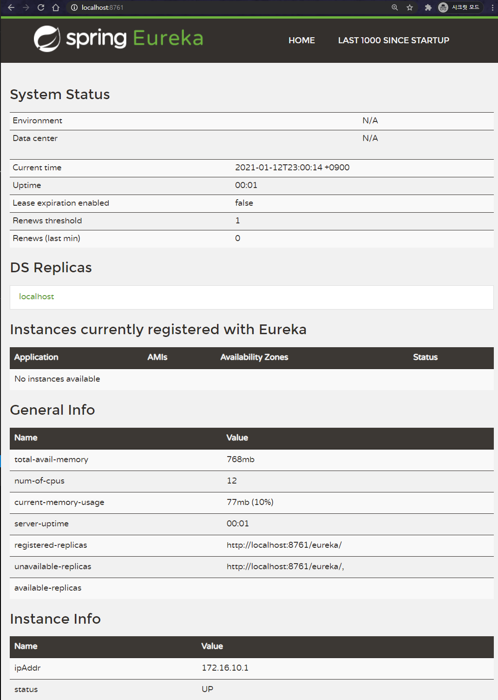

# Main함수 설정
```java
@SpringBootApplication
@EnableEurekaServer
public class Application {

    public static void main(String[] args) {
        new SpringApplicationBuilder(Application.class).web(true).run(args);
    }

}
```

# application.yaml 설정
```yaml
server:
  port: 8761

eureka:
  instance:
    preferIpAddress: true

  client:
    registerWithEureka: false
    fetchRegistry: false
    serviceUrl:
      defaultZone: http://localhost:8761/eureka
```

# 접속
* 실행 후 http://localhost:8761 접속



# 참고자료
* [1] springcloud 공식문서: https://cloud.spring.io/spring-cloud-netflix/multi/multi_spring-cloud-eureka-server.html